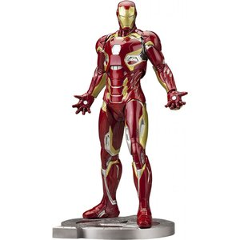
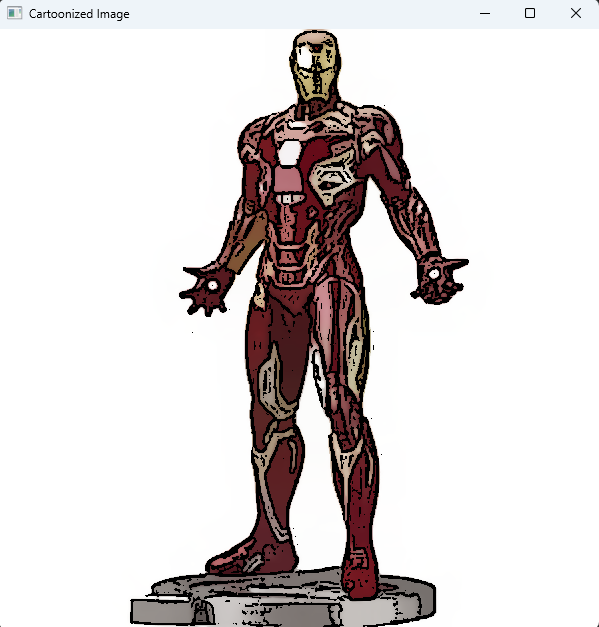
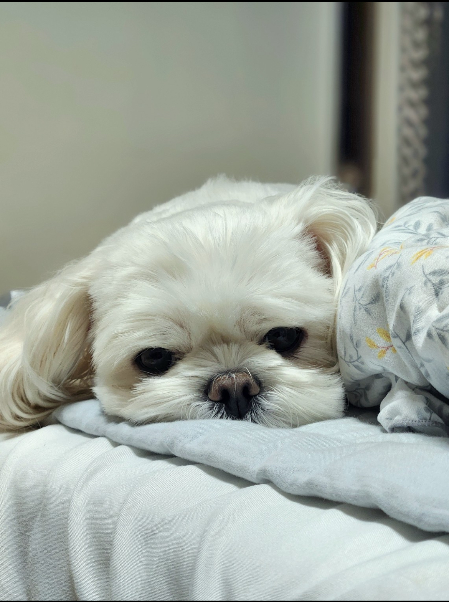
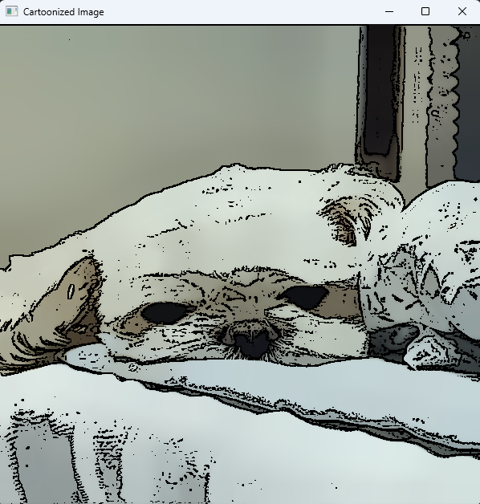

# 🖼 Cartoon Image Converter 🎨  

OpenCV를 활용하여 이미지를 **만화 스타일로 변환하는 Python 프로그램**입니다.  
Mean Shift Filtering과 Laplacian Edge Detection을 조합하여 색상을 단순화하고 윤곽선을 강조합니다.

## 📌 **프로젝트 소개**  
이 프로젝트는 **일반 이미지를 만화 스타일로 변환하는 필터**를 구현합니다.  
OpenCV의 여러 필터를 조합하여 자연스럽고 선명한 카툰 효과를 만들어냅니다.

### ✨ **사용된 주요 기술**
- **Mean Shift Filtering** → 색상을 단순화하여 만화처럼 표현  
- **Laplacian Edge Detection** → 선명한 윤곽선 검출  
- **Bilateral Filter** → 부드러운 색상 변환  

#### 예시 1
 
 
 
#### 예시 2
 
 

## 한계점

예시 2는 색상의 변화가 비교적 부드럽고, 털의 디테일이 자연스러워서 만화 같은 느낌이 잘 살아난다.

반면 예시 1은 경계선 검출 시 너무 많은 엣지가 생성되어 지나치게 많은 윤곽선이 남아 만화 느낌이 덜하다.

- **명암이 강한 이미지에서 노이즈 발생 → 부드러운 색상 변화가 아니라면 만화 느낌보다는 거친 스케치 느낌이 됨**
- **세밀한 디테일이 많은 경우 과도한 윤곽선 검출 → 얼굴, 옷의 패턴이 많으면 지저분해질 수 있음.**
